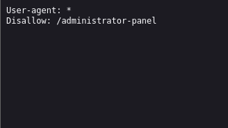
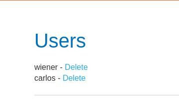

We are looking for hidden admin panel to delete carlos.

We can simply look at `robots.txt` of a site to find what administrator didn't want search engines to index.

Going to administrator-panel we can delete carlos.

It is a good practice to always chceck robots.txt first on a website.