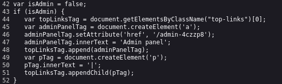

Again we are looking for administrator page but this time it is hidden with unpredictible URL address.

By looking at page source we can find intresting fragment of code

By looking at i it is clear that admin panel is hidden at `/admin-4czzp8`

