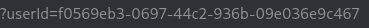
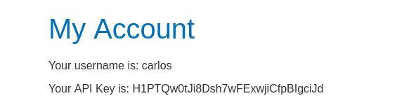

Imidietly after loging we can see that our account was given GUID

We can scour website for clues and by looking at some posts we can find carlos GUID

So back to My Account and we can change ours GUID for carlos

Now we can see his API key

