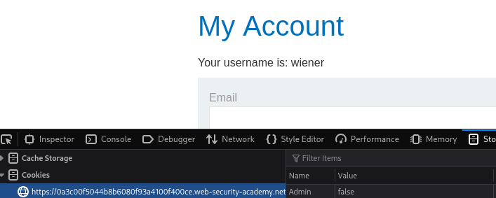
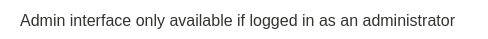
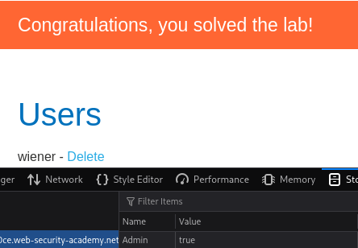

We need to delete carlos from `/admin`. We were given login credentials of a normal user `wiener:peter`

Loging into wiener and looking at local storage we can see that there is variable called Admin which is currently set as false

We can try and go to admin panel but without changing this variable there is nothing there.

By changing Admin to true we get access

